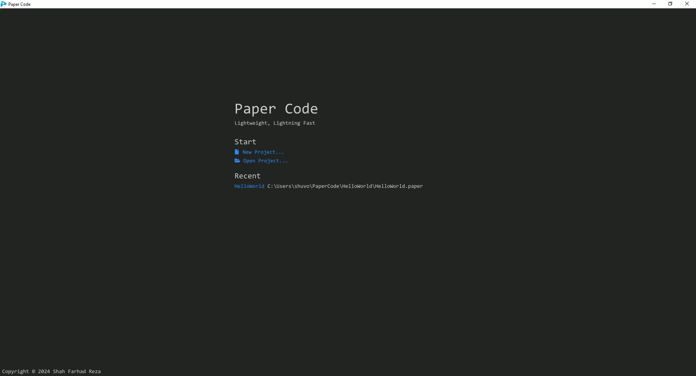

# Paper Code
Tired of bloated IDEs that slow you down? Welcome to Paper Code, the lightning-fast C++ IDE built for performance-obsessed developers.

 

# Focus on Performance

* Lightweight Design: Built with a focus on minimal resource usage, ensuring smooth operation even on older or less powerful machines.
* Hardware-Accelerated UI: Utilizes OpenGL for a responsive, lag-free and cross-platform user interface.

# Features:

* Code Editing:
  - Syntax highlighting for C++ code.
  - Support for indentation and code formatting.
* Project Management:
  - Ability to create and manage C++ projects with multiple files.
* Other Features:
  - A customizable interface to suit different preferences.
  - Support for cross-platform development (if applicable).

# Download

See Release - https://github.com/shahfarhadreza/papercode/releases/tag/beta-build-11pm-14-april-2024

# How to Build

**Paper Code** uses `CMake` to support cross-platform building. Install CMake before proceeding. The basic steps to build are:

**Note:** If you don't use the provided installer for your platform, make sure that you add CMake's bin folder to your path.

1. **Generate**

    Navigate into the root directory (where CMakeLists.txt is), create build folder and run CMake:
   
```
mkdir build
cd build
cmake [-G generator] ..\
```

The `generator` option is the build system you'd like to use. For example: `cmake -G"Ninja" ..\`

2. **Build**

The command you'll need to run depends on the generator you chose earlier. For example: Write `ninja` and hit enter. (Make sure you are in the build folder)

3. **Run**

After the building process completes, you will find the executable in the bin folder to run. 

# Dependencies

* GLFW
* ImGui
* STB
* Yaml-Cpp
* FontAwesome5

# Contributing

We welcome contributions from the C++ developer community!
